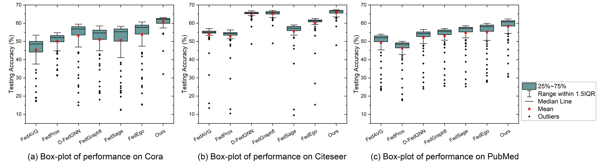

# FedPB
 Correction Code for paper: FedPB Parameter Broadcasting on Participant Graph for Federated Learning on Heterogeneous Graph. - submission ICPP 2024

# Prerequisite
NVIDIA 4090

NVIDIA Driver 520.56.06

Python 3.8.0

CUDA 11.8

Torch 2.0.1

# Datasets
Cora：The processed .zip file can be download in this [link](https://drive.google.com/file/d/1x33NTyMZ9OdSo6Uk-2LL6r2_VTJ1ZKzA/view?usp=drive_link).

Citeseer：The processed .zip file can be download in this [link](https://drive.google.com/file/d/1G--eb13nfEa4X8NhW4Z6kQ__GWawKA30/view?usp=drive_link).

Pubmeddiabetes：The processed .zip file can be download in this [link](https://drive.google.com/file/d/1W5onFRDemqgzQDOOl23yqQcnpb6vuoeY/view?usp=drive_link).

download datasets .zip file to ./Folder then unzip it.

# Train
Federated Learning

Please using folowing commands to train a model with federated learning strategy.

'''bash

python main.py --datasets_name 'cora'

python main.py --datasets_name 'citeseer'

python main.py --datasets_name 'pubmeddiabetes'

'''

Results can be found in ./Results

We provide train strategy with broken datasets. You can change the options.py to rereproduce other strategy.

# Draw
We provide .opju file in Results, all results in paper's figure are recorded in this file.

# Citation
